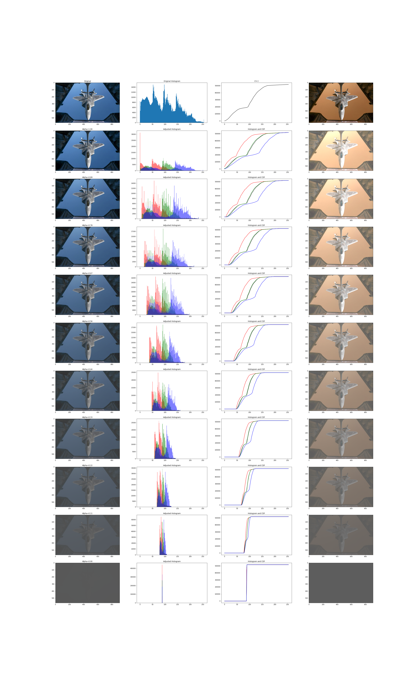
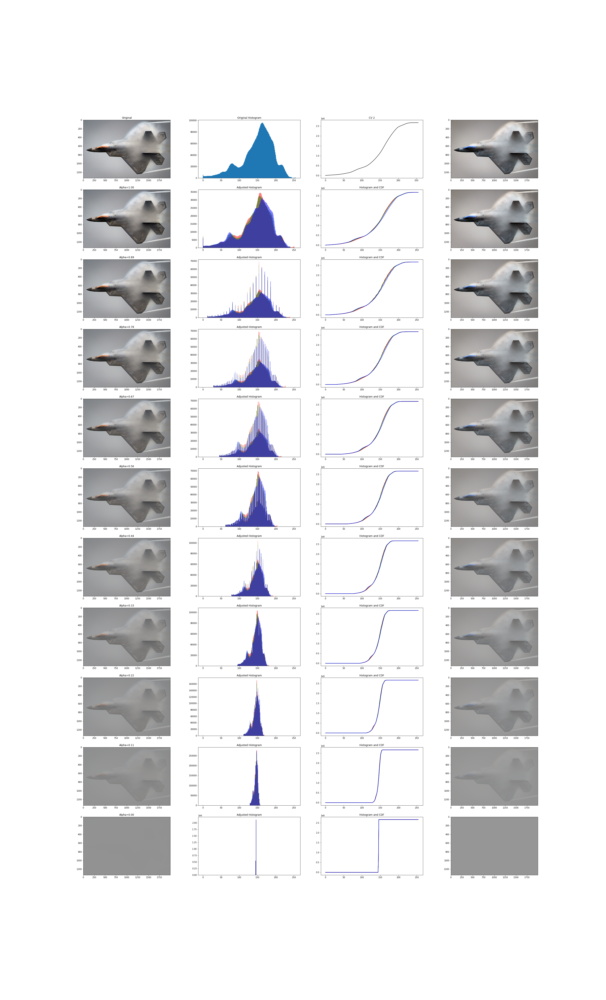
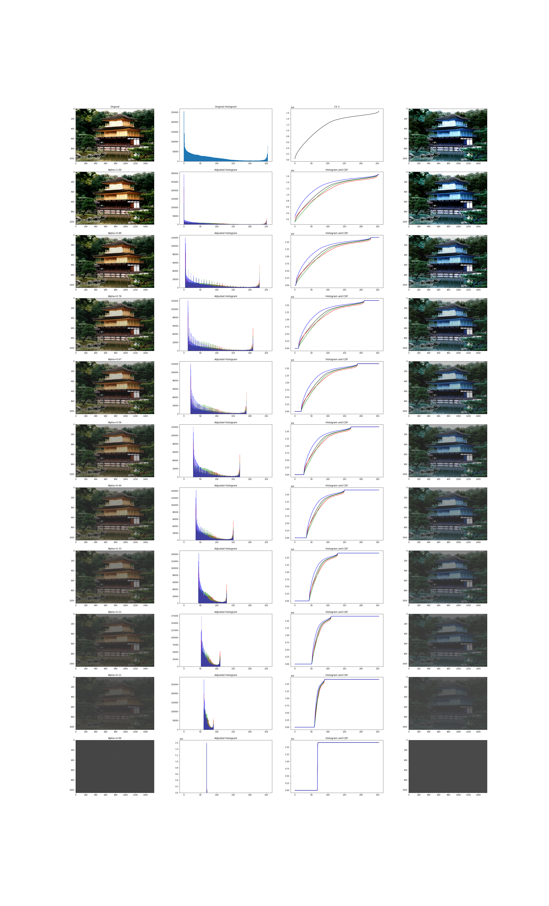

# LAB 1 Дупляк Степан
## Приклад вихідних зображень 
## На фото показано 4 стовпці 
- ### Зображення оброблене власним алгоритмом 
- ### Гістограмf зображення 
- ### Криву CDF 
- ### Тестове порівняльне перетворення із бібліотеки CV2 
зображення №1

зображення №2

зображення №3

зображення №4

